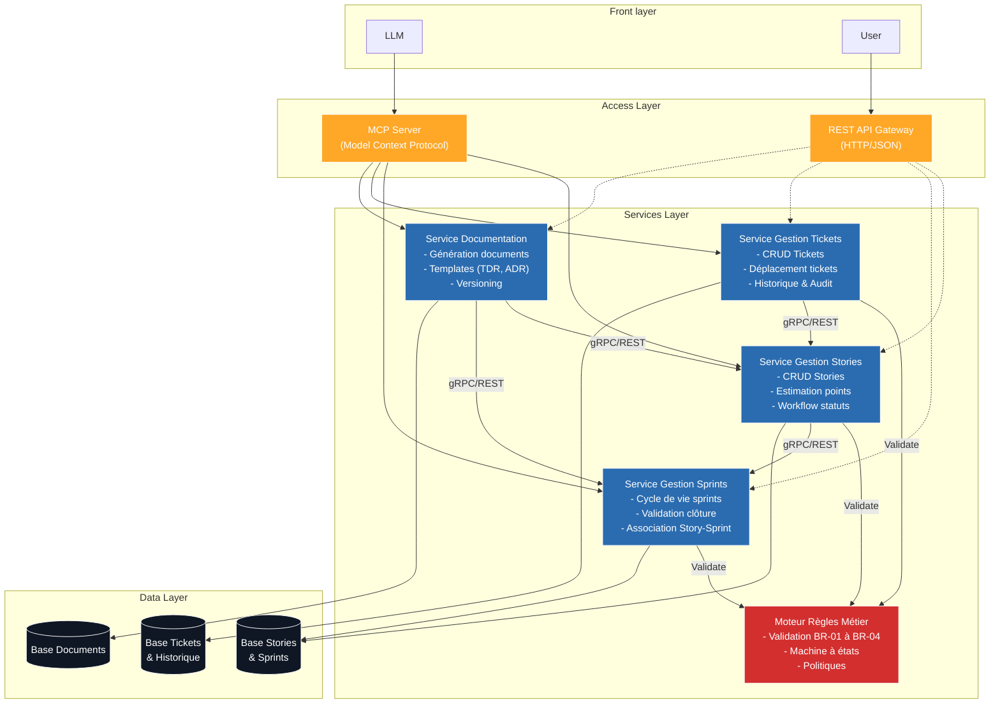
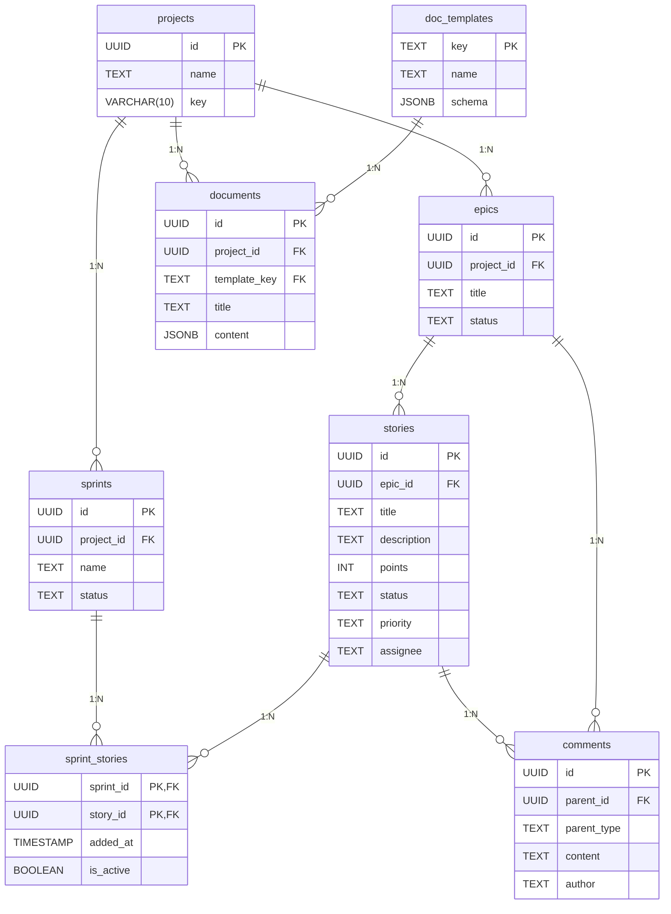
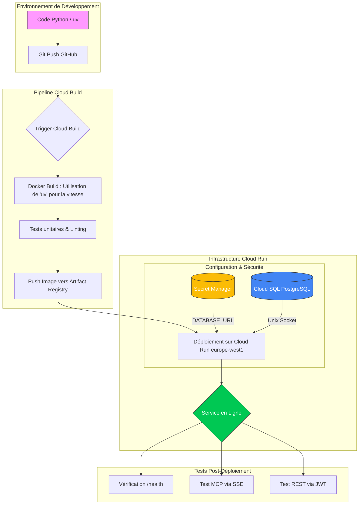

## 3.1 **Business Architecture**

### **1. Objectif**

**Définir pour qui et pourquoi vous construisez ce système.**

- **Vision :** L'objectif du LLM Task Manager est de créer un écosystème de gestion de projet où la barrière entre la conception (le dialogue avec l'IA) et l'exécution (le ticket de tâche) disparaît. Il ne s'agit pas de forcer une IA à remplir un formulaire humain, mais de lui donner les outils pour structurer le travail de manière autonome.

### **2. Personas**

**A. Léa "Tech Lead"**
- **Profil :** Responsable de la qualité et de la roadmap
- **Contexte & Besoins :** Doit s'assurer que les tickets sont clairs, bien estimés et que les décisions techniques sont documentées
- **Frustrations :** Perdre 1h par jour à traduire des discussions Slack en tickets Jira est épuisant et n'apporte aucune valeur technique

**B. Sarah "PO"**
- **Profil :** Responsable de la vision produit et des priorités métier
- **Contexte & Besoins :** Doit transformer des besoins clients flous en spécifications claires (Epics/Stories) et suivre l'avancement global sans harceler les développeurs
- **Frustrations :** Jira est un trou noir. Je passe mon temps à demander "où ça en est ?" parce que les tickets ne sont jamais à jour, et rédiger des Stories détaillées me prend un temps infini

### **3. Job To Be Done (JTBD)**

- **En tant que Tech Lead**, je veux déléguer la structuration technique et administrative de mon projet à un agent IA via MCP, afin de me concentrer sur l'architecture et le code tout en maintenant un backlog parfaitement à jour

### **4. Cas d'usage concrets**

**A. Extraction de Story en temps réel**
- Léa discute d'une nouvelle fonctionnalité de sécurité avec l'IA dans son IDE
- Sans quitter le chat, l'IA identifie les tâches nécessaires et appelle le tool `create_story` pour les ajouter au backlog

**B. Génération de Documentation Technique**
- Suite à une séance de debugging complexe, Léa demande à l'IA de résumer la solution
- L'IA utilise le tool `create_document` avec le template Technical Decision Record (TDR) pour consigner la décision dans le projet

**C. Maintenance autonome du Sprint**
- En fin de journée, l'IA analyse les Stories dont le statut est resté bloqué en `in_progress`
- Elle ajoute un commentaire sur chaque story pour demander un statut ou propose de les reporter au sprint suivant via `update_story_sprint`

### **5. Règles métier du domaine (Business Rules)**

Le système garantit l'intégrité des données via des règles strictes appliquées aux interfaces REST et MCP :

**BR-01 : Estimation Fibonacci**
- Les estimations (`story_points`) doivent obligatoirement appartenir à la suite de Fibonacci : **0, 1, 2, 3, 5, 8, 13** (poids des stories)

**BR-02 : Workflow de statut**
- Une story doit respecter l'ordre suivant : `backlog` → `todo` → `in_progress` → `in_review` → `done`
- Aucun saut d'étape n'est autorisé

**BR-03 : Unicité du Sprint Actif**
- Une story ne peut être affectée qu'à un seul sprint actif à la fois
- L'affectation à un nouveau sprint retire automatiquement la story du sprint précédent

**BR-04 : Condition de clôture**
- Un sprint ne peut être clôturé (`closed`) que si 100% de ses stories sont à l'état `done`
- Les stories restantes doivent être déplacées avant la clôture

---

## 3.2 **Architecture Suggérée**

### **1. SERVICES (Microservices/Modules)**

#### **Services Cœur**

**A. Service de Gestion des Stories**
- **Responsabilités :**
  - Opérations CRUD sur les Stories
  - Estimation en story points (validation Fibonacci - BR-01)
  - Application du workflow de statuts (BR-02)
  - Logique d'assignation aux sprints (BR-03)
- **Opérations clés :**
  - `create_story()`
  - `update_story()`
  - `update_story_status()`
  - `update_story_sprint()`
  - `list_stories()`

**B. Service de Gestion des Sprints**
- **Responsabilités :**
  - Cycle de vie des sprints (création, activation, clôture)
  - Validation de clôture (BR-04 : toutes les stories doivent être done)
  - Gestion de l'association Story-Sprint
- **Opérations clés :**
  - `create_sprint()`
  - `activate_sprint()`
  - `close_sprint()`
  - `get_sprint_status()`

**C. Service de Gestion des Tickets**
- **Responsabilités :**
  - Opérations CRUD sur les tickets individuels
  - Déplacement de tickets entre sprints/colonnes
  - Assignation et réassignation de tickets
  - Gestion des dépendances entre tickets
  -Archivage et suppression de tickets
  - Historique des modifications
- **Opérations clés :**
  - `create_ticket(title, description, assignee, priority)`
  - `update_ticket(id, fields)`
  - `move_ticket(id, target_status)` → Valide transitions BR-02
  - `assign_ticket(id, user_id)`
  - `delete_ticket(id)` → Soft delete avec archivage
  - `restore_ticket(id)` → Restauration depuis archive
  - `link_tickets(parent_id, child_id)` → Gestion dépendances
  - `get_ticket_history(id)` → Audit trail complet
  - `search_tickets(filters)` → Recherche avancée
- **Règles spécifiques :**
  - Un ticket ne peut être supprimé que s'il est en statut `backlog` ou `todo`
  - Le déplacement entre sprints nécessite validation BR-03
  - L'historique est immuable (event sourcing)

**D. Service de Documentation**
- **Responsabilités :**
  - Génération de documents basés sur templates (TDR, ADR, etc.)
  - Versioning et stockage des documents
  - Liaison documents-Stories/Sprints
- **Opérations clés :**
  - `create_document(template, context)`
  - `list_templates()`
  - `attach_document_to_story()`

**E. Moteur de Règles Métier**
- **Responsabilités :**
  - Validation centralisée des règles BR-01 à BR-04
  - Machine à états pour le workflow des stories et tickets
  - Application des politiques
- **Validations :**
  - Validateur Fibonacci
  - Validateur de transitions de statut
  - Validateur d'assignation aux sprints
  - Validateur de clôture de sprint
  - Validateur de suppression de tickets

### Diagramme d'architecture


### **2. Liste des Endpoints REST**

#### **Projets**

| Méthode | Path | Paramètres | Réponse | Codes erreur |
|---------|------|------------|---------|--------------|
| POST | `/api/v1/projects` | Body: `{name: str, description?: str}` | `{id: str, name: str, description: str, created_at: datetime}` | 400, 401 |
| GET | `/api/v1/projects` | Query: `limit?: int, offset?: int` | `{items: Project[], total: int}` | 401 |
| GET | `/api/v1/projects/{project_id}` | Path: `project_id: str` | `{id: str, name: str, description: str, created_at: datetime}` | 401, 404 |

#### **Epics**

| Méthode | Path | Paramètres | Réponse | Codes erreur |
|---------|------|------------|---------|--------------|
| POST | `/api/v1/projects/{project_id}/epics` | Path: `project_id: str`<br>Body: `{title: str, description: str, status?: str}` | `{id: str, project_id: str, title: str, description: str, status: str, created_at: datetime}` | 400, 401, 404 |
| GET | `/api/v1/projects/{project_id}/epics/{epic_id}` | Path: `project_id: str, epic_id: str` | `{id: str, project_id: str, title: str, description: str, status: str, created_at: datetime, updated_at: datetime}` | 401, 404 |
| PUT | `/api/v1/projects/{project_id}/epics/{epic_id}` | Path: `project_id: str, epic_id: str`<br>Body: `{title?: str, description?: str, status?: str}` | `{id: str, ...updated_fields, updated_at: datetime}` | 400, 401, 404 |
| GET | `/api/v1/projects/{project_id}/epics` | Path: `project_id: str`<br>Query: `status?: str, search?: str, limit?: int, offset?: int` | `{items: Epic[], total: int}` | 401, 404 |

#### **Stories**

| Méthode | Path | Paramètres | Réponse | Codes erreur |
|---------|------|------------|---------|--------------|
| POST | `/api/v1/projects/{project_id}/epics/{epic_id}/stories` | Path: `project_id: str, epic_id: str`<br>Body: `{title: str, description: str, story_points?: int, priority?: str, assignee?: str}` | `{id: str, epic_id: str, title: str, description: str, story_points: int, priority: str, status: str, assignee: str\|null, created_at: datetime}` | 400, 401, 404, 422 (BR-01) |
| GET | `/api/v1/projects/{project_id}/stories/{story_id}` | Path: `project_id: str, story_id: str` | `{id: str, epic_id: str, title: str, description: str, story_points: int, priority: str, status: str, assignee: str\|null, sprint_id: str\|null, created_at: datetime, updated_at: datetime}` | 401, 404 |
| PUT | `/api/v1/projects/{project_id}/stories/{story_id}` | Path: `project_id: str, story_id: str`<br>Body: `{title?: str, description?: str, story_points?: int, priority?: str, assignee?: str}` | `{id: str, ...updated_fields, updated_at: datetime}` | 400, 401, 404, 422 (BR-01) |
| PATCH | `/api/v1/projects/{project_id}/stories/{story_id}/status` | Path: `project_id: str, story_id: str`<br>Body: `{status: str}` | `{id: str, status: str, updated_at: datetime}` | 401, 404, 422 (BR-02: `INVALID_STATUS_TRANSITION`) |
| PATCH | `/api/v1/projects/{project_id}/stories/{story_id}/sprint` | Path: `project_id: str, story_id: str`<br>Body: `{sprint_id: str\|null}` | `{id: str, sprint_id: str\|null, updated_at: datetime}` | 401, 404, 422 (BR-03: `STORY_ALREADY_IN_ACTIVE_SPRINT`) |
| GET | `/api/v1/projects/{project_id}/stories` | Path: `project_id: str`<br>Query: `status?: str, priority?: str, assignee?: str, sprint_id?: str, search?: str, limit?: int, offset?: int` | `{items: Story[], total: int}` | 401, 404 |

#### **Sprints**

| Méthode | Path | Paramètres | Réponse | Codes erreur |
|---------|------|------------|---------|--------------|
| POST | `/api/v1/projects/{project_id}/sprints` | Path: `project_id: str`<br>Body: `{name: str, goal: str, start_date: date, end_date: date}` | `{id: str, project_id: str, name: str, goal: str, status: str, start_date: date, end_date: date, created_at: datetime}` | 400, 401, 404 |
| POST | `/api/v1/projects/{project_id}/sprints/{sprint_id}/activate` | Path: `project_id: str, sprint_id: str` | `{id: str, status: str, activated_at: datetime}` | 401, 404, 422 |
| POST | `/api/v1/projects/{project_id}/sprints/{sprint_id}/close` | Path: `project_id: str, sprint_id: str` | `{id: str, status: str, closed_at: datetime}` | 401, 404, 422 (BR-04: `SPRINT_HAS_INCOMPLETE_STORIES`) |
| GET | `/api/v1/projects/{project_id}/sprints/{sprint_id}` | Path: `project_id: str, sprint_id: str` | `{id: str, project_id: str, name: str, goal: str, status: str, start_date: date, end_date: date, stories: Story[], created_at: datetime}` | 401, 404 |
| GET | `/api/v1/projects/{project_id}/sprints` | Path: `project_id: str`<br>Query: `status?: str, limit?: int, offset?: int` | `{items: Sprint[], total: int}` | 401, 404 |

#### **Tickets**

| Méthode | Path | Paramètres | Réponse | Codes erreur |
|---------|------|------------|---------|--------------|
| POST | `/api/v1/projects/{project_id}/stories/{story_id}/tickets` | Path: `project_id: str, story_id: str`<br>Body: `{title: str, description: str, assignee?: str, priority?: str}` | `{id: str, story_id: str, title: str, description: str, assignee: str\|null, priority: str, status: str, created_at: datetime}` | 400, 401, 404 |
| PUT | `/api/v1/projects/{project_id}/tickets/{ticket_id}` | Path: `project_id: str, ticket_id: str`<br>Body: `{title?: str, description?: str, assignee?: str, priority?: str}` | `{id: str, ...updated_fields, updated_at: datetime}` | 400, 401, 404 |
| PATCH | `/api/v1/projects/{project_id}/tickets/{ticket_id}/move` | Path: `project_id: str, ticket_id: str`<br>Body: `{target_status: str}` | `{id: str, status: str, updated_at: datetime}` | 401, 404, 422 (BR-02) |
| PATCH | `/api/v1/projects/{project_id}/tickets/{ticket_id}/assign` | Path: `project_id: str, ticket_id: str`<br>Body: `{user_id: str}` | `{id: str, assignee: str, updated_at: datetime}` | 401, 404 |
| DELETE | `/api/v1/projects/{project_id}/tickets/{ticket_id}` | Path: `project_id: str, ticket_id: str` | `204 No Content` | 401, 404, 422 (`CANNOT_DELETE_TICKET_IN_PROGRESS`) |
| POST | `/api/v1/projects/{project_id}/tickets/{ticket_id}/restore` | Path: `project_id: str, ticket_id: str` | `{id: str, status: str, restored_at: datetime}` | 401, 404 |
| POST | `/api/v1/projects/{project_id}/tickets/link` | Path: `project_id: str`<br>Body: `{parent_id: str, child_id: str}` | `{parent_id: str, child_id: str, linked_at: datetime}` | 401, 404, 422 |
| GET | `/api/v1/projects/{project_id}/tickets/{ticket_id}/history` | Path: `project_id: str, ticket_id: str` | `{items: HistoryEntry[], total: int}` | 401, 404 |
| GET | `/api/v1/projects/{project_id}/tickets` | Path: `project_id: str`<br>Query: `story_id?: str, status?: str, assignee?: str, limit?: int, offset?: int` | `{items: Ticket[], total: int}` | 401, 404 |

#### **Commentaires**

| Méthode | Path | Paramètres | Réponse | Codes erreur |
|---------|------|------------|---------|--------------|
| POST | `/api/v1/projects/{project_id}/epics/{epic_id}/comments` | Path: `project_id: str, epic_id: str`<br>Body: `{author: str, content: str}` | `{id: str, epic_id: str, author: str, content: str, created_at: datetime}` | 400, 401, 404 |
| POST | `/api/v1/projects/{project_id}/stories/{story_id}/comments` | Path: `project_id: str, story_id: str`<br>Body: `{author: str, content: str}` | `{id: str, story_id: str, author: str, content: str, created_at: datetime}` | 400, 401, 404 |
| GET | `/api/v1/projects/{project_id}/epics/{epic_id}/comments` | Path: `project_id: str, epic_id: str`<br>Query: `limit?: int, offset?: int` | `{items: Comment[], total: int}` | 401, 404 |
| GET | `/api/v1/projects/{project_id}/stories/{story_id}/comments` | Path: `project_id: str, story_id: str`<br>Query: `limit?: int, offset?: int` | `{items: Comment[], total: int}` | 401, 404 |

#### **Documents**

| Méthode | Path | Paramètres | Réponse | Codes erreur |
|---------|------|------------|---------|--------------|
| POST | `/api/v1/projects/{project_id}/documents` | Path: `project_id: str`<br>Body: `{title: str, content: str, template?: str}` | `{id: str, project_id: str, title: str, content: str, template: str\|null, version: int, created_at: datetime}` | 400, 401, 404 |
| GET | `/api/v1/projects/{project_id}/documents/{document_id}` | Path: `project_id: str, document_id: str` | `{id: str, project_id: str, title: str, content: str, template: str\|null, version: int, created_at: datetime, updated_at: datetime}` | 401, 404 |
| PUT | `/api/v1/projects/{project_id}/documents/{document_id}` | Path: `project_id: str, document_id: str`<br>Body: `{title?: str, content?: str}` | `{id: str, ...updated_fields, version: int, updated_at: datetime}` | 400, 401, 404 |
| GET | `/api/v1/projects/{project_id}/documents` | Path: `project_id: str`<br>Query: `search?: str, template?: str, limit?: int, offset?: int` | `{items: Document[], total: int}` | 401, 404 |
| GET | `/api/v1/templates` | Query: `type?: str` | `{items: Template[], total: int}` | 401 |

#### **Health & Métadonnées**

| Méthode | Path | Paramètres | Réponse | Codes erreur |
|---------|------|------------|---------|--------------|
| GET | `/health` | - | `{status: "healthy", timestamp: datetime}` | - |
| GET | `/api/v1/business-rules` | - | `{rules: BusinessRule[]}` | 401 |

### **3. Liste des Tools MCP**

Les tools MCP exposent les mêmes capacités que l'API REST mais avec des descriptions optimisées pour la compréhension par un LLM. Chaque tool dispose d'une docstring détaillée expliquant son usage et ses paramètres.

#### **Projets**

| Tool | Paramètres | Retour | Description LLM |
|------|------------|--------|-----------------|
| `create_project` | `name: str, description: str` | `Project` | Crée un nouveau projet pour organiser des epics et stories. Utilise ce tool au début d'une conversation pour initialiser un nouveau workspace. |
| `list_projects` | `limit: int = 50` | `list[Project]` | Liste tous les projets accessibles. Utilise ce tool pour découvrir les projets existants avant de créer des stories. |
| `get_project` | `project_id: str` | `Project` | Récupère les détails d'un projet spécifique par son identifiant. |

#### **Epics**

| Tool | Paramètres | Retour | Description LLM |
|------|------------|--------|-----------------|
| `create_epic` | `project_id: str, title: str, description: str, status: str = "backlog"` | `Epic` | Crée un epic (grande fonctionnalité) dans un projet. Un epic regroupe plusieurs stories liées. Exemple : "Migration vers Python 3.12". |
| `get_epic` | `project_id: str, epic_id: str` | `Epic` | Récupère un epic spécifique avec tous ses détails. |
| `update_epic` | `project_id: str, epic_id: str, title?: str, description?: str, status?: str` | `Epic` | Met à jour un epic existant. Utilise ce tool pour changer le statut ou affiner la description. |
| `list_epics` | `project_id: str, status?: str, search?: str` | `list[Epic]` | Liste les epics d'un projet. Filtre par statut (backlog, in_progress, done) ou recherche par mot-clé dans les titres. |

#### **Stories**

| Tool | Paramètres | Retour | Description LLM |
|------|------------|--------|-----------------|
| `create_story` | `project_id: str, epic_id: str, title: str, description: str, story_points: int = 0, priority: str = "medium", assignee?: str` | `Story` | Crée une story (tâche utilisateur) dans un epic. Les story_points doivent être dans la suite de Fibonacci (0,1,2,3,5,8,13). La description doit inclure les critères d'acceptation. |
| `get_story` | `project_id: str, story_id: str` | `Story` | Récupère une story avec son statut, estimation et assignation actuelle. |
| `update_story` | `project_id: str, story_id: str, title?: str, description?: str, story_points?: int, priority?: str, assignee?: str` | `Story` | Met à jour les métadonnées d'une story. Attention : les story_points doivent respecter Fibonacci (BR-01). |
| `update_story_status` | `project_id: str, story_id: str, status: str` | `Story` | Change le statut d'une story. Les transitions doivent respecter l'ordre : backlog → todo → in_progress → in_review → done (BR-02). |
| `update_story_sprint` | `project_id: str, story_id: str, sprint_id?: str` | `Story` | Affecte ou retire une story d'un sprint. Une story ne peut être que dans un seul sprint actif à la fois (BR-03). |
| `list_stories` | `project_id: str, status?: str, priority?: str, assignee?: str, sprint_id?: str, search?: str` | `list[Story]` | Liste et filtre les stories d'un projet. Utilise les filtres pour trouver les stories d'un sprint spécifique ou assignées à une personne. |

#### **Sprints**

| Tool | Paramètres | Retour | Description LLM |
|------|------------|--------|-----------------|
| `create_sprint` | `project_id: str, name: str, goal: str, start_date: date, end_date: date` | `Sprint` | Crée un nouveau sprint avec un objectif clair. Le sprint démarre en statut 'draft'. |
| `activate_sprint` | `project_id: str, sprint_id: str` | `Sprint` | Active un sprint (passe de 'draft' à 'active'). Un seul sprint peut être actif à la fois dans un projet. |
| `close_sprint` | `project_id: str, sprint_id: str` | `Sprint` | Clôture un sprint. ATTENTION : toutes les stories du sprint doivent être à l'état 'done' (BR-04), sinon l'opération échouera. |
| `get_sprint` | `project_id: str, sprint_id: str` | `Sprint` | Récupère un sprint avec la liste complète de ses stories et leur progression. |
| `list_sprints` | `project_id: str, status?: str` | `list[Sprint]` | Liste les sprints d'un projet, filtrés par statut (draft, active, closed). |

#### **Tickets**

| Tool | Paramètres | Retour | Description LLM |
|------|------------|--------|-----------------|
| `create_ticket` | `project_id: str, story_id: str, title: str, description: str, assignee?: str, priority: str = "medium"` | `Ticket` | Crée un ticket (sous-tâche technique) lié à une story. Utilise ce tool pour décomposer une story en tâches granulaires. |
| `update_ticket` | `project_id: str, ticket_id: str, title?: str, description?: str, assignee?: str, priority?: str` | `Ticket` | Met à jour un ticket existant. |
| `move_ticket` | `project_id: str, ticket_id: str, target_status: str` | `Ticket` | Déplace un ticket vers un nouveau statut (backlog → todo → in_progress → in_review → done). |
| `assign_ticket` | `project_id: str, ticket_id: str, user_id: str` | `Ticket` | Assigne un ticket à un développeur spécifique. |
| `delete_ticket` | `project_id: str, ticket_id: str` | `void` | Supprime (soft delete) un ticket. Attention : impossible si le ticket est en cours (in_progress ou in_review). |
| `restore_ticket` | `project_id: str, ticket_id: str` | `Ticket` | Restaure un ticket archivé. |
| `link_tickets` | `project_id: str, parent_id: str, child_id: str` | `void` | Crée une relation de dépendance entre deux tickets (parent bloque child). |
| `get_ticket_history` | `project_id: str, ticket_id: str` | `list[HistoryEntry]` | Récupère l'historique complet des modifications d'un ticket (audit trail). |
| `list_tickets` | `project_id: str, story_id?: str, status?: str, assignee?: str` | `list[Ticket]` | Liste les tickets avec filtrage. Utilise story_id pour voir toutes les sous-tâches d'une story. |

#### **Commentaires**

| Tool | Paramètres | Retour | Description LLM |
|------|------------|--------|-----------------|
| `add_comment_to_epic` | `project_id: str, epic_id: str, author: str, content: str` | `Comment` | Ajoute un commentaire à un epic. Utilise ce tool pour documenter des décisions ou poser des questions sur un epic. |
| `add_comment_to_story` | `project_id: str, story_id: str, author: str, content: str` | `Comment` | Ajoute un commentaire à une story. Idéal pour clarifier des critères d'acceptation ou signaler des blocages. |
| `list_epic_comments` | `project_id: str, epic_id: str` | `list[Comment]` | Liste tous les commentaires d'un epic dans l'ordre chronologique. |
| `list_story_comments` | `project_id: str, story_id: str` | `list[Comment]` | Liste tous les commentaires d'une story dans l'ordre chronologique. |

#### **Documents**

| Tool | Paramètres | Retour | Description LLM |
|------|------------|--------|-----------------|
| `create_document` | `project_id: str, title: str, content: str, template?: str` | `Document` | Crée un document dans le projet. Si 'template' est spécifié (TDR, SPEC, RETRO, VISION), le contenu sera structuré selon ce template. |
| `get_document` | `project_id: str, document_id: str` | `Document` | Récupère un document spécifique avec son contenu complet. |
| `update_document` | `project_id: str, document_id: str, title?: str, content?: str` | `Document` | Met à jour un document (le numéro de version s'incrémente automatiquement). |
| `list_documents` | `project_id: str, search?: str, template?: str` | `list[Document]` | Liste les documents d'un projet. Filtre par type de template ou recherche par mot-clé. |
| `list_templates` | `type?: str` | `list[Template]` | Liste les templates disponibles (Technical Decision Record, Product Vision, Problem Statement, Sprint Retrospective). Utilise ce tool pour découvrir les structures de documents prédéfinies. |

### **4. Justification Architecturale**

**Choix : 1 service unique exposant REST + MCP**

**Raison :**
- **Cohérence de la logique métier :** Les règles BR-01 à BR-04 doivent être appliquées de manière identique qu'on passe par REST ou MCP. Un service unique garantit que le Moteur de Règles Métier est partagé.
- **Simplicité de déploiement :** Un seul conteneur Cloud Run à maintenir, une seule base de données à connecter.
- **Performance :** Pas de latence réseau entre un service MCP et un service REST.
- **Coût :** Optimisation des ressources (un seul instance pool à scaler).

**Architecture interne du service :**
```
src/
├── main.py              # Point d'entrée FastAPI + MCP
├── api/                 # Endpoints REST
│   ├── projects.py
│   ├── epics.py
│   ├── stories.py
│   └── ...
├── mcp/                 # Tools MCP
│   ├── server.py
│   └── tools.py
├── services/            # Logique métier partagée
│   ├── story_service.py
│   ├── sprint_service.py
│   └── rules_engine.py
├── models/              # Modèles Pydantic + SQLAlchemy
└── db/                  # Connexion et migrations
```

#### **Intégration du SDK Python MCP**

**A. Installation et Import**

https://github.com/modelcontextprotocol/python-sdk?tab=readme-ov-file#installation

**B. Placement dans l'architecture**

Le SDK MCP est utilisé dans **deux fichiers clés** :

**1. `src/mcp/server.py` : Initialisation du serveur MCP**
```python
from mcp.server import Server
from mcp.server.sse import SseServerTransport
from fastapi import FastAPI

# Création de l'instance serveur MCP
mcp_server = Server("llm-task-manager")

# Initialisation dans FastAPI (transport SSE pour Cloud Run)
def init_mcp_sse(app: FastAPI):
    """Monte le serveur MCP sur FastAPI via SSE."""
    sse_transport = SseServerTransport("/mcp/sse")
    app.mount("/mcp", sse_transport.asgi_app())
    return mcp_server
```

**2. `src/mcp/tools.py` : Déclaration des tools avec décorateur `@mcp.tool()`**
```python
from mcp.server import Server
from src.services.story_service import StoryService
from src.models.schemas import Story

mcp_server = Server("llm-task-manager")

@mcp_server.tool()
async def create_story(
    project_id: str,
    epic_id: str,
    title: str,
    description: str,
    story_points: int = 0,
    priority: str = "medium",
    assignee: str | None = None
) -> dict:
    """Crée une story dans un epic.
    
    Les story_points doivent être dans la suite de Fibonacci (0,1,2,3,5,8,13).
    La description doit inclure les critères d'acceptation.
    
    Args:
        project_id: Identifiant du projet
        epic_id: Identifiant de l'epic parent
        title: Titre de la story (5-300 caractères)
        description: Description détaillée avec critères d'acceptation
        story_points: Estimation de l'effort (Fibonacci)
        priority: Priorité (low, medium, high, critical)
        assignee: Personne assignée (optionnel)
    
    Returns:
        Story créée avec son identifiant unique
    """
    # Appel au service métier (partagé avec l'API REST)
    story = await StoryService.create(
        project_id=project_id,
        epic_id=epic_id,
        title=title,
        description=description,
        story_points=story_points,
        priority=priority,
        assignee=assignee
    )
    return story.model_dump()
```

**C. Point d'entrée unifié : `src/main.py`**
```python
from fastapi import FastAPI
from src.api import projects, epics, stories, sprints  # Routes REST
from src.mcp.server import init_mcp_sse
from src.mcp import tools  # Import pour enregistrer les tools

app = FastAPI(title="LLM Task Manager")

# Montage des routes REST
app.include_router(projects.router, prefix="/api/v1")
app.include_router(epics.router, prefix="/api/v1")
app.include_router(stories.router, prefix="/api/v1")
app.include_router(sprints.router, prefix="/api/v1")

# Montage du serveur MCP (transport SSE)
mcp_server = init_mcp_sse(app)

@app.get("/health")
async def health_check():
    return {"status": "healthy"}
```

**D. Flux d'exécution**

```
1. Claude Desktop/Claude Code se connecte à /mcp/sse
2. Le client MCP demande la liste des tools disponibles
3. Le serveur MCP retourne les 27 tools déclarés avec @mcp_server.tool()
4. Le LLM décide d'appeler create_story
5. Le client MCP envoie les paramètres au serveur MCP
6. Le tool create_story() appelle StoryService.create() (logique partagée)
7. StoryService valide via RulesEngine (BR-01 : Fibonacci)
8. La story est persistée en PostgreSQL
9. Le résultat est retourné au LLM via le client MCP
```

**E. Avantages de cette architecture**

| Aspect | Bénéfice |
|--------|----------|
| **Logique partagée** | `StoryService` est appelé identiquement par `POST /api/v1/stories` (REST) et par `create_story()` (MCP) |
| **Validation unifiée** | Les modèles Pydantic et le `RulesEngine` sont réutilisés dans les deux points d'entrée |
| **Déploiement simplifié** | Un seul conteneur Cloud Run expose `/api/*` (REST) et `/mcp/sse` (MCP) |
| **Transport adapté au cloud** | SSE (Server-Sent Events) fonctionne sur HTTP, compatible avec Cloud Run (contrairement à stdio qui nécessite un process local) |

**Trade-off accepté :**
- Un service unique signifie que si le serveur MCP crash, l'API REST devient temporairement indisponible (et inversement). Cependant, dans le cadre d'un MVP et avec la supervision de Cloud Run (health checks + auto-restart), ce risque est acceptable.

### **5. Contrat de Validation**

#### **Validation par Entité**

| Entité | Champ | Contrainte | Validation Pydantic | Validation SQL | Code erreur HTTP |
|--------|-------|------------|---------------------|----------------|------------------|
| **Project** | `name` | Longueur 3-200 caractères | `Field(min_length=3, max_length=200)` | `CHECK (LENGTH(name) BETWEEN 3 AND 200)` | 400 `NAME_TOO_SHORT/LONG` |
| **Epic** | `title` | Longueur 5-300 caractères | `Field(min_length=5, max_length=300)` | `CHECK (LENGTH(title) >= 5)` | 400 `TITLE_TOO_SHORT/LONG` |
| **Epic** | `status` | Valeurs autorisées | `Literal["backlog", "in_progress", "done"]` | `CHECK (status IN (...))` | 400 `INVALID_STATUS` |
| **Story** | `title` | Longueur 5-300 caractères | `Field(min_length=5, max_length=300)` | `CHECK (LENGTH(title) >= 5)` | 400 `TITLE_TOO_SHORT/LONG` |
| **Story** | `story_points` | Suite de Fibonacci (BR-01) | `Field(ge=0)` + validator custom | `CHECK (story_points IN (0,1,2,3,5,8,13))` | 422 `INVALID_STORY_POINTS` |
| **Story** | `status` | Workflow ordonné (BR-02) | `Literal[...]` | `CHECK (status IN (...))` | 422 `INVALID_STATUS_TRANSITION` |
| **Story** | `priority` | Valeurs autorisées | `Literal["low", "medium", "high", "critical"]` | `CHECK (priority IN (...))` | 400 `INVALID_PRIORITY` |
| **Sprint** | `name` | Longueur 3-100 caractères | `Field(min_length=3, max_length=100)` | - | 400 `NAME_TOO_SHORT/LONG` |
| **Sprint** | `end_date` | Après `start_date` | `@field_validator` | `CHECK (end_date > start_date)` | 400 `INVALID_DATE_RANGE` |
| **Ticket** | `title` | Longueur 3-200 caractères | `Field(min_length=3, max_length=200)` | - | 400 `TITLE_TOO_SHORT/LONG` |
| **Comment** | `content` | Longueur 1-5000 caractères | `Field(min_length=1, max_length=5000)` | - | 400 `CONTENT_TOO_LONG` |
| **Document** | `title` | Longueur 3-500 caractères | `Field(min_length=3, max_length=500)` | - | 400 `TITLE_TOO_SHORT/LONG` |

#### **Stratégie de Défense**

**Couche 1 : Validation Pydantic (Point d'entrée)**
- Validation des types, longueurs et formats
- Conversion automatique des types (ex: `date` depuis ISO string)
- Messages d'erreur explicites pour le client

**Couche 2 : Logique Métier (Services)**
- Validation des règles métier (BR-01 à BR-04)
- Vérification des transitions de statuts
- Contrôle d'unicité (ex: sprint actif unique)

**Couche 3 : Base de Données (PostgreSQL)**
- Contraintes `CHECK` pour garantir l'intégrité même en cas de bug applicatif
- Index `UNIQUE` partiels (ex: `is_active = TRUE` pour stories dans sprints)
- Foreign keys avec `ON DELETE CASCADE` ou `RESTRICT` selon le contexte

**Partage entre REST et MCP :**
- Les modèles Pydantic sont **réutilisés** pour la validation des inputs MCP
- Les services métier sont **appelés identiquement** par les routes REST et les tools MCP
- Le Moteur de Règles Métier est **unique et centralisé**

## 3.3 **Data Architecture**
L'architecture de données repose sur un modèle relationnel PostgreSQL rigoureux. La validation des données est effectuée en profondeur : d'abord par des contraintes SQL natives (premier niveau), puis par Pydantic au niveau applicatif.

### **1. Schéma des tables**

| Table | Colonnes (Type) | Contraintes |
|-------|----------------|-------------|
| `projects` | `id` (UUID), `name` (TEXT), `key` (VARCHAR(10)) | PK, UNIQUE(key), NOT NULL |
| `epics` | `id` (UUID), `project_id` (UUID), `title` (TEXT), `status` (TEXT) | PK, FK(projects), NOT NULL |
| `stories` | `id` (UUID), `epic_id` (UUID), `title` (TEXT), `description` (TEXT), `points` (INT), `status` (TEXT), `priority` (TEXT), `assignee` (TEXT) | PK, FK(epics), CHECK (points IN (0,1,2,3,5,8,13)), NOT NULL |
| `sprints` | `id` (UUID), `project_id` (UUID), `name` (TEXT), `status` (TEXT) | PK, FK(projects), CHECK (status IN ('draft', 'active', 'closed')) |
| `sprint_stories` | `sprint_id` (UUID), `story_id` (UUID), `added_at` (TIMESTAMP), `is_active` (BOOLEAN) | PK(sprint_id, story_id), FK(sprints), FK(stories) |
| `comments` | `id` (UUID), `parent_id` (UUID), `parent_type` (TEXT), `content` (TEXT), `author` (TEXT) | PK, CHECK (parent_type IN ('story', 'epic')) |
| `documents` | `id` (UUID), `project_id` (UUID), `template_key` (TEXT), `title` (TEXT), `content` (JSONB) | PK, FK(projects), FK(doc_templates) |
| `doc_templates` | `key` (TEXT), `name` (TEXT), `schema` (JSONB) | PK (ex: 'TDR', 'SPEC', 'RETRO') |

### **2. Relations et Cardinalités**

**A. Projets, Epics & Stories (1:N)**
- Un projet contient plusieurs Epics, chaque Epic contient plusieurs Stories
- L'intégrité est maintenue via des clés étrangères (ON DELETE CASCADE sur les commentaires)

**B. Polymorphisme des Commentaires**
- Utilisation des colonnes `parent_id` et `parent_type` pour permettre d'attacher des commentaires à la fois aux Stories et aux Epics sans multiplier les tables

**C. Relation Many-to-Many Historique (Stories <-> Sprints)**
- La table de jonction `sprint_stories` conserve la trace de chaque passage d'une story dans un sprint
- **Règle BR-03 (Unicité active) :** Un index partiel unique garantit qu'une story ne peut être "active" que dans un seul sprint à la fois :

```sql
CREATE UNIQUE INDEX idx_one_active_sprint_per_story 
ON sprint_stories (story_id) WHERE (is_active = TRUE);
```

### **3. Diagramme Entité-Relation (ERD)**



### **4. Indexation pour la performance**

Pour optimiser les outils MCP (recherche et filtrage rapide), les index suivants sont déployés :

**A. Recherche textuelle (LLM)**
```sql
CREATE INDEX idx_stories_fts ON stories USING GIN(to_tsvector('french', title || ' ' || description));
```

**B. Filtrage par statut/sprint**
```sql
CREATE INDEX idx_stories_status_sprint ON stories(status, epic_id);
```

**C. Performance jointure**
```sql
CREATE INDEX idx_sprint_stories_lookup ON sprint_stories(story_id, is_active);
```

### **5. Stratégie de Persistence des Documents**

**A. Templates**
- Stockés dans `doc_templates` sous forme de schémas JSON (JSON Schema)
- Cela permet au serveur MCP de décrire dynamiquement au LLM les champs attendus pour un TDR ou une Retrospective

**B. Instances**
- Les documents finaux sont stockés dans la table `documents`
- Le contenu est de type JSONB pour permettre une indexation efficace des champs internes tout en restant flexible face aux évolutions des templates

---

## 3.4 **Technology Architecture**

L'infrastructure est entièrement "Serverless" sur Google Cloud Platform (GCP) pour minimiser l'ops et garantir une scalabilité immédiate.

### **1. Diagramme de Déploiement**



### **2. Services GCP utilisés**

| Service | Justification |
|---------|---------------|
| **Cloud Run** | Hébergement du conteneur FastAPI/MCP. Pay-as-you-go et isolation forte |
| **Cloud SQL (PostgreSQL)** | Base de données managée. Support natif des contraintes CHECK et JSONB |
| **Cloud Build** | Pipeline CI/CD automatisé pour le déploiement continu depuis GitHub |
| **Secret Manager** | Stockage sécurisé des clés API et des credentials de la base de données |
| **Artifact Registry** | Stockage des images Docker versionnées |

### **3. Configuration de Scaling et Performance**

**A. Région**
- **Région :** `europe-west1` pour des performances otpimisées et une souveraineté de la data

**B. Scaling**
- **min-instances :** 0 (optimisation des coûts, acceptation du cold start pour ce TP)
- **max-instances :** 5 (suffisant pour un usage en binôme et tests LLM)

**C. Gestion du Cold Start**
- Utilisation d'un runtime optimisé (`uv` pour une installation ultra-rapide des dépendances lors du build)
- Limitation du nombre de librairies chargées au démarrage

**D. Concurrency**
- Réglé à **80 requêtes simultanées** par instance

### **4. Stratégie de connexion BDD**

Pour une sécurité maximale et une simplicité de configuration sur Cloud Run, la connexion utilise le Cloud SQL Python Connector via un Unix Socket :

**A. Méthode**
- Utilisation de la bibliothèque `cloud-sql-python-connector`

**B. Avantages**
- Pas besoin de gérer les listes blanches d'IP
- Chiffrement IAM automatique
- Performance supérieure au proxy TCP externe

**C. URL de connexion**
- `postgresql+asyncpg://` (pour supporter l'asynchronisme de FastAPI)

### **5. Pipeline CI/CD (Cloud Build)**

Le pipeline est déclenché à chaque push sur la branche `main`.

**A. Build**
- Construction de l'image Docker à l'aide de `uv` pour un cache optimisé

**B. Lint & Test**
- Exécution de `pytest` et `ruff` à l'intérieur du conteneur temporaire

**C. Migration**
- Exécution des migrations Alembic (via un job Cloud Run temporaire) pour mettre à jour le schéma PostgreSQL sans downtime

**D. Deploy**
- Mise à jour du service Cloud Run avec la nouvelle image via `gcloud run deploy`

---

## 3.5 **Security Architecture**

La sécurité du système repose sur une approche "Zero Trust" entre les clients (humains ou agents) et l'API, avec une validation stricte à chaque couche.

### **1. Stratégies d'Authentification**

**A. REST API**
- **Méthode :** Utilisation de JWT (JSON Web Tokens)
- **Justification :** Permet une authentification stateless adaptée à Cloud Run, facilite la gestion des rôles (claims) et évite des appels répétés à la BDD pour vérifier les sessions

**B. MCP Server**
- **Transport :** Via SSE (Server-Sent Events) sur HTTP
- **Authentification :** Le client MCP doit passer un `Authorization: Bearer <JWT>` dans les headers de la connexion initiale
- **Impersonation :** L'agent MCP agit **au nom de l'utilisateur** via le JWT. Il hérite des permissions de l'utilisateur authentifié et ne peut pas faire plus que ce que l'humain qui utilise l'agent a le droit de faire
- **Justification :** Contrairement au mode stdio (local), le mode SSE est nécessaire pour un déploiement Cloud Run. La sécurité est alignée sur l'API REST avec validation des permissions basée sur le JWT

### **2. Matrice de Permissions (RBAC)**

**Principe d'Impersonation :** L'agent MCP hérite des permissions de l'utilisateur authentifié via le JWT. Il agit au nom de l'utilisateur et ne peut pas dépasser les droits de celui-ci.

| Entité | Rôle : Admin (Léa) | Rôle : Contributeur (Sarah) | Agent MCP (via JWT) |
|--------|-------------------|----------------------------|---------------------|
| **Projets/Sprints** | Full CRUD + Clôture | Lecture seule | **Hérite des droits de l'utilisateur** |
| **Stories/Tickets** | Full CRUD | Création / Update | **CRUD selon les permissions de l'utilisateur** |
| **Documents** | Full CRUD | Création / Lecture | **Création (Template) selon les permissions** |
| **Configuration** | Gestion des clés | Interdit | **Interdit (même pour Admin)** |

**Note :** L'agent MCP dispose de droits CRUD complets, mais uniquement dans le cadre des permissions de l'utilisateur authentifié. Un agent connecté avec le JWT d'un Contributeur ne pourra pas effectuer d'actions réservées aux Admins.

### **3. Mesures de Protection et Défense en Profondeur**

Le système applique une stratégie de défense en profondeur sur quatre couches pour chaque requête (REST ou MCP) :

**A. Couche Transport (GCP)**
- Chiffrement TLS 1.3 forcé sur Cloud Run
- Protection contre les attaques DDoS via Google Cloud Armor (standard)

**B. Couche Validation (Pydantic)**
- Premier rempart applicatif
- Vérification des types, des formats d'UUID, et de la suite de Fibonacci pour les points
- Rejet immédiat si le schéma est invalide

**C. Couche Logique Métier (Service Layer)**
- Validation des transitions de workflow (BR-02) et des règles de clôture de sprint (BR-04)
- Cette couche est partagée entre le routeur FastAPI et le serveur MCP pour garantir une cohérence absolue

**D. Couche Persistence (SQL)**
- Utilisation systématique de requêtes paramétrées via l'ORM (prévention des injections SQL)
- Contraintes CHECK en base de données comme ultime filet de sécurité

### **4. Contrôle d'Accès et Abus**

**A. Rate Limiting**
- Limite de **100 requêtes/minute** par utilisateur
- Plus stricte pour les tools MCP afin d'éviter les boucles infinies d'agents IA

**B. Audit Trail**
- Chaque modification via un tool MCP est enregistrée avec une mention `agent_id`
- Permet de tracer les actions effectuées par l'IA par rapport aux actions humaines

**C. Politique d'exposition MCP**
- Seuls les tools explicitement décorés avec `@mcp.tool()` sont visibles par le LLM
- Aucun accès direct aux tables système ou aux secrets n'est exposé

---