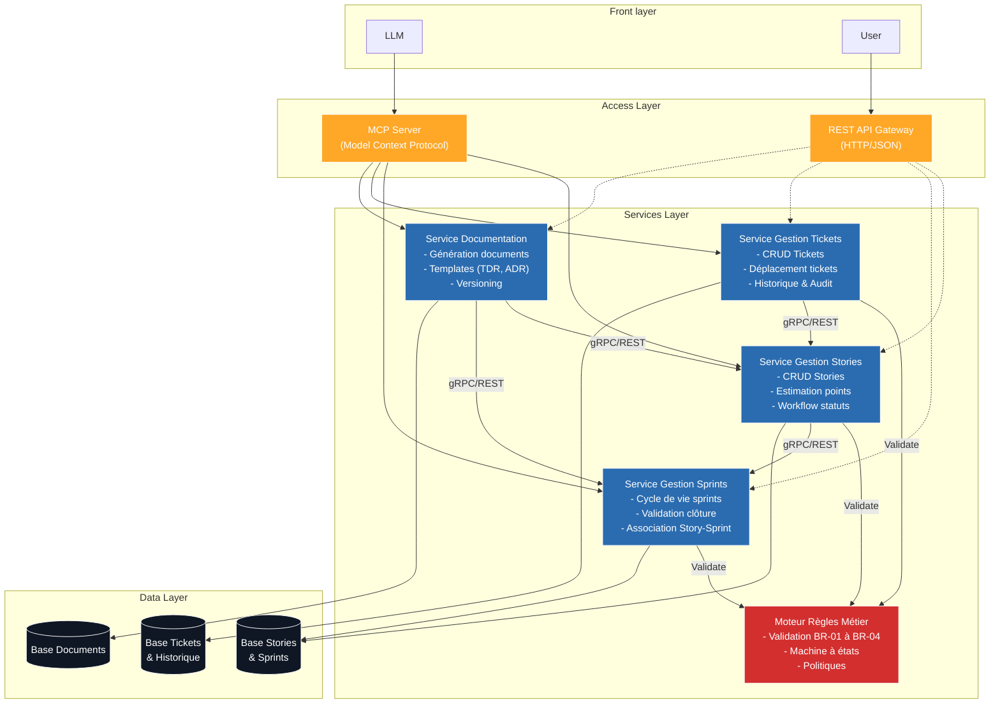

## 3.1 **Business Architecture**

### **1. Objectif**

**Définir pour qui et pourquoi vous construisez ce système.**

- **Vision :** L'objectif du LLM Task Manager est de créer un écosystème de gestion de projet où la barrière entre la conception (le dialogue avec l'IA) et l'exécution (le ticket de tâche) disparaît. Il ne s'agit pas de forcer une IA à remplir un formulaire humain, mais de lui donner les outils pour structurer le travail de manière autonome.

### **2. Personas**

**A. Léa "Tech Lead"**
- **Profil :** Responsable de la qualité et de la roadmap
- **Contexte & Besoins :** Doit s'assurer que les tickets sont clairs, bien estimés et que les décisions techniques sont documentées
- **Frustrations :** Perdre 1h par jour à traduire des discussions Slack en tickets Jira est épuisant et n'apporte aucune valeur technique

**B. Sarah "PO"**
- **Profil :** Responsable de la vision produit et des priorités métier
- **Contexte & Besoins :** Doit transformer des besoins clients flous en spécifications claires (Epics/Stories) et suivre l'avancement global sans harceler les développeurs
- **Frustrations :** Jira est un trou noir. Je passe mon temps à demander "où ça en est ?" parce que les tickets ne sont jamais à jour, et rédiger des Stories détaillées me prend un temps infini

### **3. Job To Be Done (JTBD)**

- **En tant que Tech Lead**, je veux déléguer la structuration technique et administrative de mon projet à un agent IA via MCP, afin de me concentrer sur l'architecture et le code tout en maintenant un backlog parfaitement à jour

### **4. Cas d'usage concrets**

**A. Extraction de Story en temps réel**
- Léa discute d'une nouvelle fonctionnalité de sécurité avec l'IA dans son IDE
- Sans quitter le chat, l'IA identifie les tâches nécessaires et appelle le tool `create_story` pour les ajouter au backlog

**B. Génération de Documentation Technique**
- Suite à une séance de debugging complexe, Léa demande à l'IA de résumer la solution
- L'IA utilise le tool `create_document` avec le template Technical Decision Record (TDR) pour consigner la décision dans le projet

**C. Maintenance autonome du Sprint**
- En fin de journée, l'IA analyse les Stories dont le statut est resté bloqué en `in_progress`
- Elle ajoute un commentaire sur chaque story pour demander un statut ou propose de les reporter au sprint suivant via `update_story_sprint`

### **5. Règles métier du domaine (Business Rules)**

Le système garantit l'intégrité des données via des règles strictes appliquées aux interfaces REST et MCP :

**BR-01 : Estimation Fibonacci**
- Les estimations (`story_points`) doivent obligatoirement appartenir à la suite de Fibonacci : **0, 1, 2, 3, 5, 8, 13** (poids des stories)

**BR-02 : Workflow de statut**
- Une story doit respecter l'ordre suivant : `backlog` → `todo` → `in_progress` → `in_review` → `done`
- Aucun saut d'étape n'est autorisé

**BR-03 : Unicité du Sprint Actif**
- Une story ne peut être affectée qu'à un seul sprint actif à la fois
- L'affectation à un nouveau sprint retire automatiquement la story du sprint précédent

**BR-04 : Condition de clôture**
- Un sprint ne peut être clôturé (`closed`) que si 100% de ses stories sont à l'état `done`
- Les stories restantes doivent être déplacées avant la clôture

---

## 3.2 **Architecture Suggérée**

### **1. SERVICES (Microservices/Modules)**

#### **Services Cœur**

**A. Service de Gestion des Stories**
- **Responsabilités :**
  - Opérations CRUD sur les Stories
  - Estimation en story points (validation Fibonacci - BR-01)
  - Application du workflow de statuts (BR-02)
  - Logique d'assignation aux sprints (BR-03)
- **Opérations clés :**
  - `create_story()`
  - `update_story()`
  - `update_story_status()`
  - `update_story_sprint()`
  - `list_stories()`

**B. Service de Gestion des Sprints**
- **Responsabilités :**
  - Cycle de vie des sprints (création, activation, clôture)
  - Validation de clôture (BR-04 : toutes les stories doivent être done)
  - Gestion de l'association Story-Sprint
- **Opérations clés :**
  - `create_sprint()`
  - `activate_sprint()`
  - `close_sprint()`
  - `get_sprint_status()`

**C. Service de Gestion des Tickets**
- **Responsabilités :**
  - Opérations CRUD sur les tickets individuels
  - Déplacement de tickets entre sprints/colonnes
  - Assignation et réassignation de tickets
  - Gestion des dépendances entre tickets
  -Archivage et suppression de tickets
  - Historique des modifications
- **Opérations clés :**
  - `create_ticket(title, description, assignee, priority)`
  - `update_ticket(id, fields)`
  - `move_ticket(id, target_status)` → Valide transitions BR-02
  - `assign_ticket(id, user_id)`
  - `delete_ticket(id)` → Soft delete avec archivage
  - `restore_ticket(id)` → Restauration depuis archive
  - `link_tickets(parent_id, child_id)` → Gestion dépendances
  - `get_ticket_history(id)` → Audit trail complet
  - `search_tickets(filters)` → Recherche avancée
- **Règles spécifiques :**
  - Un ticket ne peut être supprimé que s'il est en statut `backlog` ou `todo`
  - Le déplacement entre sprints nécessite validation BR-03
  - L'historique est immuable (event sourcing)

**D. Service de Documentation**
- **Responsabilités :**
  - Génération de documents basés sur templates (TDR, ADR, etc.)
  - Versioning et stockage des documents
  - Liaison documents-Stories/Sprints
- **Opérations clés :**
  - `create_document(template, context)`
  - `list_templates()`
  - `attach_document_to_story()`

**E. Moteur de Règles Métier**
- **Responsabilités :**
  - Validation centralisée des règles BR-01 à BR-04
  - Machine à états pour le workflow des stories et tickets
  - Application des politiques
- **Validations :**
  - Validateur Fibonacci
  - Validateur de transitions de statut
  - Validateur d'assignation aux sprints
  - Validateur de clôture de sprint
  - Validateur de suppression de tickets

### Diagramme d'architecture


## 3.3 **Data Architecture**
L'architecture de données repose sur un modèle relationnel PostgreSQL rigoureux. La validation des données est effectuée en profondeur : d'abord par des contraintes SQL natives (premier niveau), puis par Pydantic au niveau applicatif.

### **1. Schéma des tables**

| Table | Colonnes (Type) | Contraintes |
|-------|----------------|-------------|
| `projects` | `id` (UUID), `name` (TEXT), `key` (VARCHAR(10)) | PK, UNIQUE(key), NOT NULL |
| `epics` | `id` (UUID), `project_id` (UUID), `title` (TEXT), `status` (TEXT) | PK, FK(projects), NOT NULL |
| `stories` | `id` (UUID), `epic_id` (UUID), `title` (TEXT), `description` (TEXT), `points` (INT), `status` (TEXT), `priority` (TEXT), `assignee` (TEXT) | PK, FK(epics), CHECK (points IN (0,1,2,3,5,8,13)), NOT NULL |
| `sprints` | `id` (UUID), `project_id` (UUID), `name` (TEXT), `status` (TEXT) | PK, FK(projects), CHECK (status IN ('draft', 'active', 'closed')) |
| `sprint_stories` | `sprint_id` (UUID), `story_id` (UUID), `added_at` (TIMESTAMP), `is_active` (BOOLEAN) | PK(sprint_id, story_id), FK(sprints), FK(stories) |
| `comments` | `id` (UUID), `parent_id` (UUID), `parent_type` (TEXT), `content` (TEXT), `author` (TEXT) | PK, CHECK (parent_type IN ('story', 'epic')) |
| `documents` | `id` (UUID), `project_id` (UUID), `template_key` (TEXT), `title` (TEXT), `content` (JSONB) | PK, FK(projects), FK(doc_templates) |
| `doc_templates` | `key` (TEXT), `name` (TEXT), `schema` (JSONB) | PK (ex: 'TDR', 'SPEC', 'RETRO') |

### **2. Relations et Cardinalités**

**A. Projets, Epics & Stories (1:N)**
- Un projet contient plusieurs Epics, chaque Epic contient plusieurs Stories
- L'intégrité est maintenue via des clés étrangères (ON DELETE CASCADE sur les commentaires)

**B. Polymorphisme des Commentaires**
- Utilisation des colonnes `parent_id` et `parent_type` pour permettre d'attacher des commentaires à la fois aux Stories et aux Epics sans multiplier les tables

**C. Relation Many-to-Many Historique (Stories <-> Sprints)**
- La table de jonction `sprint_stories` conserve la trace de chaque passage d'une story dans un sprint
- **Règle BR-03 (Unicité active) :** Un index partiel unique garantit qu'une story ne peut être "active" que dans un seul sprint à la fois :

```sql
CREATE UNIQUE INDEX idx_one_active_sprint_per_story 
ON sprint_stories (story_id) WHERE (is_active = TRUE);
```

### **3. Diagramme Entité-Relation (ERD)**

*[À compléter avec le diagramme ERD]*

### **4. Indexation pour la performance**

Pour optimiser les outils MCP (recherche et filtrage rapide), les index suivants sont déployés :

**A. Recherche textuelle (LLM)**
```sql
CREATE INDEX idx_stories_fts ON stories USING GIN(to_tsvector('french', title || ' ' || description));
```

**B. Filtrage par statut/sprint**
```sql
CREATE INDEX idx_stories_status_sprint ON stories(status, epic_id);
```

**C. Performance jointure**
```sql
CREATE INDEX idx_sprint_stories_lookup ON sprint_stories(story_id, is_active);
```

### **5. Stratégie de Persistence des Documents**

**A. Templates**
- Stockés dans `doc_templates` sous forme de schémas JSON (JSON Schema)
- Cela permet au serveur MCP de décrire dynamiquement au LLM les champs attendus pour un TDR ou une Retrospective

**B. Instances**
- Les documents finaux sont stockés dans la table `documents`
- Le contenu est de type JSONB pour permettre une indexation efficace des champs internes tout en restant flexible face aux évolutions des templates

---

## 3.4 **Technology Architecture**

L'infrastructure est entièrement "Serverless" sur Google Cloud Platform (GCP) pour minimiser l'ops et garantir une scalabilité immédiate.

### **1. Diagramme de Déploiement**

*[À compléter avec le diagramme de déploiement]*

### **2. Services GCP utilisés**

| Service | Justification |
|---------|---------------|
| **Cloud Run** | Hébergement du conteneur FastAPI/MCP. Pay-as-you-go et isolation forte |
| **Cloud SQL (PostgreSQL)** | Base de données managée. Support natif des contraintes CHECK et JSONB |
| **Cloud Build** | Pipeline CI/CD automatisé pour le déploiement continu depuis GitHub |
| **Secret Manager** | Stockage sécurisé des clés API et des credentials de la base de données |
| **Artifact Registry** | Stockage des images Docker versionnées |

### **3. Configuration de Scaling et Performance**

**A. Région**
- **Région :** `europe-west1` (Belgique) pour minimiser la latence et l'empreinte carbone

**B. Scaling**
- **min-instances :** 0 (optimisation des coûts, acceptation du cold start pour ce TP)
- **max-instances :** 5 (suffisant pour un usage en binôme et tests LLM)

**C. Gestion du Cold Start**
- Utilisation d'un runtime optimisé (`uv` pour une installation ultra-rapide des dépendances lors du build)
- Limitation du nombre de librairies chargées au démarrage

**D. Concurrency**
- Réglé à **80 requêtes simultanées** par instance

### **4. Stratégie de connexion BDD**

Pour une sécurité maximale et une simplicité de configuration sur Cloud Run, la connexion utilise le Cloud SQL Python Connector via un Unix Socket :

**A. Méthode**
- Utilisation de la bibliothèque `cloud-sql-python-connector`

**B. Avantages**
- Pas besoin de gérer les listes blanches d'IP
- Chiffrement IAM automatique
- Performance supérieure au proxy TCP externe

**C. URL de connexion**
- `postgresql+asyncpg://` (pour supporter l'asynchronisme de FastAPI)

### **5. Pipeline CI/CD (Cloud Build)**

Le pipeline est déclenché à chaque push sur la branche `main`.

**A. Build**
- Construction de l'image Docker à l'aide de `uv` pour un cache optimisé

**B. Lint & Test**
- Exécution de `pytest` et `ruff` à l'intérieur du conteneur temporaire

**C. Migration**
- Exécution des migrations Alembic (via un job Cloud Run temporaire) pour mettre à jour le schéma PostgreSQL sans downtime

**D. Deploy**
- Mise à jour du service Cloud Run avec la nouvelle image via `gcloud run deploy`

---

## 3.5 **Security Architecture**

La sécurité du système repose sur une approche "Zero Trust" entre les clients (humains ou agents) et l'API, avec une validation stricte à chaque couche.

### **1. Stratégies d'Authentification**

**A. REST API**
- **Méthode :** Utilisation de JWT (JSON Web Tokens)
- **Justification :** Permet une authentification stateless adaptée à Cloud Run, facilite la gestion des rôles (claims) et évite des appels répétés à la BDD pour vérifier les sessions

**B. MCP Server**
- **Transport :** Via SSE (Server-Sent Events) sur HTTP
- **Authentification :** Le client MCP doit passer un `Authorization: Bearer <JWT>` dans les headers de la connexion initiale
- **Impersonation :** L'agent MCP agit **au nom de l'utilisateur** via le JWT. Il hérite des permissions de l'utilisateur authentifié et ne peut pas faire plus que ce que l'humain qui utilise l'agent a le droit de faire
- **Justification :** Contrairement au mode stdio (local), le mode SSE est nécessaire pour un déploiement Cloud Run. La sécurité est alignée sur l'API REST avec validation des permissions basée sur le JWT

### **2. Matrice de Permissions (RBAC)**

**Principe d'Impersonation :** L'agent MCP hérite des permissions de l'utilisateur authentifié via le JWT. Il agit au nom de l'utilisateur et ne peut pas dépasser les droits de celui-ci.

| Entité | Rôle : Admin (Léa) | Rôle : Contributeur (Sarah) | Agent MCP (via JWT) |
|--------|-------------------|----------------------------|---------------------|
| **Projets/Sprints** | Full CRUD + Clôture | Lecture seule | **Hérite des droits de l'utilisateur** |
| **Stories/Tickets** | Full CRUD | Création / Update | **CRUD selon les permissions de l'utilisateur** |
| **Documents** | Full CRUD | Création / Lecture | **Création (Template) selon les permissions** |
| **Configuration** | Gestion des clés | Interdit | **Interdit (même pour Admin)** |

**Note :** L'agent MCP dispose de droits CRUD complets, mais uniquement dans le cadre des permissions de l'utilisateur authentifié. Un agent connecté avec le JWT d'un Contributeur ne pourra pas effectuer d'actions réservées aux Admins.

### **3. Mesures de Protection et Défense en Profondeur**

Le système applique une stratégie de défense en profondeur sur quatre couches pour chaque requête (REST ou MCP) :

**A. Couche Transport (GCP)**
- Chiffrement TLS 1.3 forcé sur Cloud Run
- Protection contre les attaques DDoS via Google Cloud Armor (standard)

**B. Couche Validation (Pydantic)**
- Premier rempart applicatif
- Vérification des types, des formats d'UUID, et de la suite de Fibonacci pour les points
- Rejet immédiat si le schéma est invalide

**C. Couche Logique Métier (Service Layer)**
- Validation des transitions de workflow (BR-02) et des règles de clôture de sprint (BR-04)
- Cette couche est partagée entre le routeur FastAPI et le serveur MCP pour garantir une cohérence absolue

**D. Couche Persistence (SQL)**
- Utilisation systématique de requêtes paramétrées via l'ORM (prévention des injections SQL)
- Contraintes CHECK en base de données comme ultime filet de sécurité

### **4. Contrôle d'Accès et Abus**

**A. Rate Limiting**
- Limite de **100 requêtes/minute** par utilisateur
- Plus stricte pour les tools MCP afin d'éviter les boucles infinies d'agents IA

**B. Audit Trail**
- Chaque modification via un tool MCP est enregistrée avec une mention `agent_id`
- Permet de tracer les actions effectuées par l'IA par rapport aux actions humaines

**C. Politique d'exposition MCP**
- Seuls les tools explicitement décorés avec `@mcp.tool()` sont visibles par le LLM
- Aucun accès direct aux tables système ou aux secrets n'est exposé

---